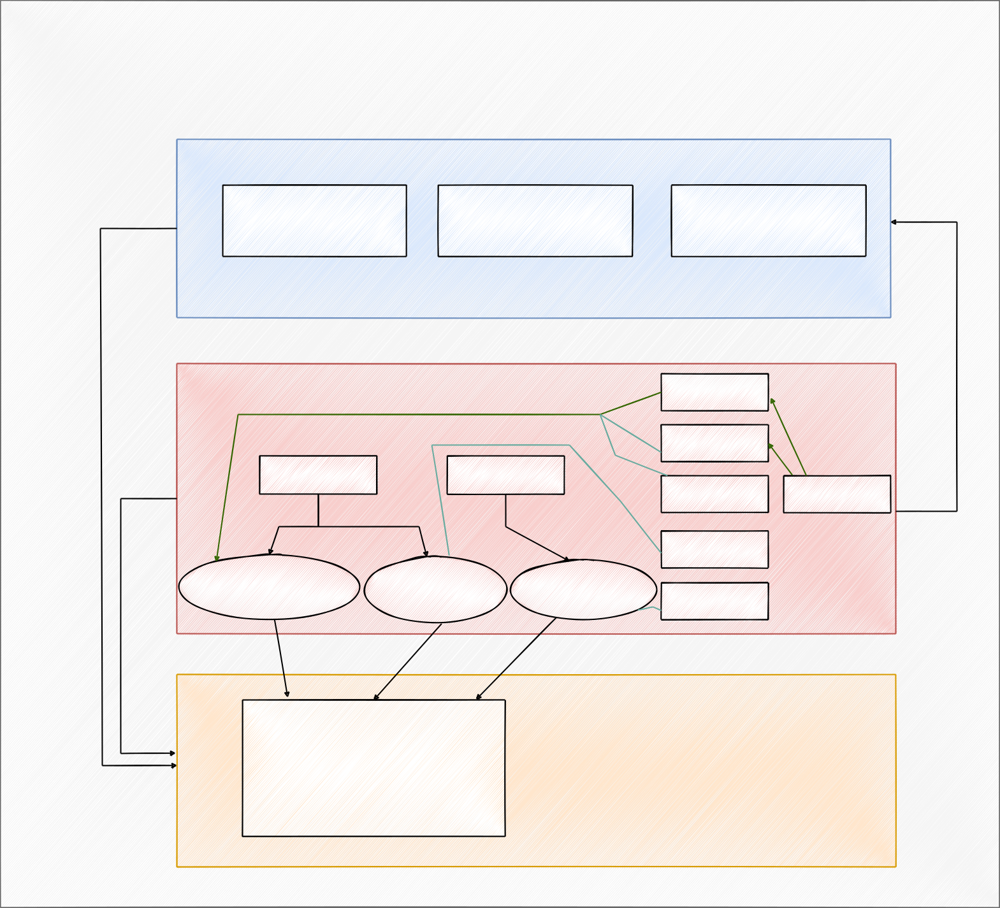

SDK for work with indoor navigation.

Использование:

Взаимодействие с функционалом SDK осуществляется через API синглтон класс типа _IndoorService_

Внутри IndoorService на данный момент находятся три вспомогательных класса, каждый из которых отвечает за отведенный ему функционал:
+ AzimuthManager
    > Отвечает за получение азимута при помощи встроенных датчиков (IMU) телефона
+ BeaconsEnvironment
    > Отвечает за получение количества BLE маяков вокруг, а также расстояние до каждого из них в метрах
+ Position
    > Позволяет методом трилатерации определить положение пользователя (2D-координату) при помощи передаваемой ему дистанции до каждого маячка, а также заданных в начале константных координат самих маячков.

Подробный функционал каждого из вспомогательных классов выше:
1. _AzimuthManager_
    + Начать мониторинг сенсоров: __startListen()__ и __stopListen()__ для остановки мониторинга, вызываются обычно в методах onResume и onPause() соответсвенно.
    + Получить последнее полученное значение азимута: __getAzimuth()__
    + Получить viewmodel для подписки на данные: __getAzimuthViewModel()__
2. _BeaconsEnvironment_
    + Начать поиск и анализ маячков: __startRanging()__ и __stopRanging()__ для остановки поиска маячков, вызываются обычно в методах onResume и onPause() соответсвенно.
    + Получить последнюю полученную информацию о маячках: __getRanging()__
    + Получить viewmodel для подписки на данные о маячках: __getRangingViewModel()__
3. _Position_
    + __setEnvironment()__ вызывается единожды для установки начальных позиций маячков. В качестве аргумента принимает коллекцию из элементов типа StateEnvironment, в которой храниться mac-адрес маячка (тип String) и  стуктура Point с координатами x, y (тип Double). (*__Без вызова этого метода, остальные методы данного класса работать не будут!__*)
    + __getPosition()__ вызывается сколь угодно для получения позиции пользователя, рассчитывающегося при помощи установленных ранее в методе setEnvironment() начальных позиций маячков, а также дистанций до каждого маячка, передаваемых в качестве входного параметра, который является коллекцией с элементами типа EnvironmentInfo. EnvironmentInfo представляет собой структуру с полями id (тип String) и distance (тип Double)

Схема SDK:

*Возможные проблемы:*
Если программа не может определить конфигарацию для сборки (требует ее добавить), то необоходимо зайти в пункт меню 'File' -> 'Invalidate Caches...'